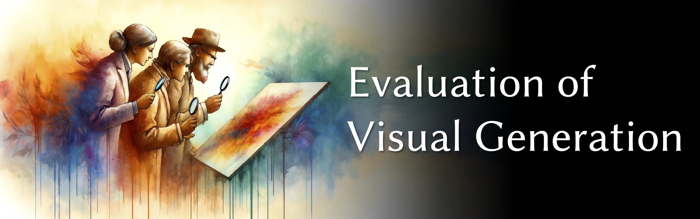

# Awesome Evaluation of Visual Generation

*This repository collects methods for evaluating visual generation.*

## Overview

### What You'll Find Here

Within this repository, we collect works that aim to answer some critical questions in the field of evaluating visual generation, such as:

- **Model Evaluation**: How does one determine the quality of a specific image or video generation model?
- **Sample/Content Evaluation**: What methods can be used to evaluate the quality of a particular generated image or video?
- **User Control Consistency Evaluation**: How to tell how well the generated images and videos align with the user controls or inputs?

### Updates

This repository is updated periodically. If you have suggestions for additional resources, updates on methodologies, or fixes for expiring links, please feel free to do any of the following:
- raise an [Issue](https://github.com/ziqihuangg/Awesome-Evaluation-of-Visual-Generation/issues),
- nominate awesome related works with [Pull Requests](https://github.com/ziqihuangg/Awesome-Evaluation-of-Visual-Generation/pulls),
- We are also contactable via email (`ZIQI002 at e dot ntu dot edu dot sg`).

### Table of Contents
- [1. Evaluation Metrics of Generative Models](#1.)
  - [1.1. Evaluation Metrics of Image Generation](#1.1.)
  - [1.2. Evaluation Metrics of Video Generation](#1.2.)
  - [1.3. Evaluation Metrics for Latent Representation](#1.3.)
- [2. Evaluation Metrics of Condition Consistency](#2.)
  - [2.1 Evaluation Metrics of Multi-Modal Condition Consistency](#2.1.)
  - [2.2. Evaluation Metrics of Image Similarity](#2.2.)
- [3. Evaluation Systems of Generative Models](#3.)
  - [3.1. Evaluation of Unconditional Image Generation](#3.1.)
  - [3.2. Evaluation of Text-to-Image Generation](#3.2.)
  - [3.3. Evaluation of Text-Based Image Editing](#3.3.)
  - [3.4. Evaluation of Neural Style Transfer](#3.4.)
  - [3.5. Evaluation of Video Generation](#3.5.)
  - [3.6. Evaluation of Text-to-Motion Generation](#3.6.)
  - [3.7. Evaluation of Model Trustworthiness](#3.7.)
  - [3.8. Evaluation of Entity Relation](#3.8.)
  - [3.9. Agentic Evaluation](#3.9.)
- [4. Improving Visual Generation with Evaluation / Feedback / Reward](#4.)
- [5. Quality Assessment for AIGC](#5.)
- [6. Study and Rethinking](#6.)
- [7. Other Useful Resources](#7.)

## 1. Evaluation Metrics of Generative Models

### 1.1. Evaluation Metrics of Image Generation

| Metric | Paper | Code |
| -------- |  -------- |  ------- |
| Inception Score (IS) | [Improved Techniques for Training GANs](https://arxiv.org/abs/1606.03498) (NeurIPS 2016) |  |
| Fréchet Inception Distance (FID) | [GANs Trained by a Two Time-Scale Update Rule Converge to a Local Nash Equilibrium](https://arxiv.org/abs/1706.08500) (NeurIPS 2017) |   |
| Kernel Inception Distance (KID) | [Demystifying MMD GANs](https://arxiv.org/abs/1801.01401) (ICLR 2018) |     
| CLIP-FID | [The Role of ImageNet Classes in Fréchet Inception Distance](https://arxiv.org/abs/2203.06026) (ICLR 2023) |    |
| Precision-and-Recall |[Assessing Generative Models via Precision and Recall](https://arxiv.org/abs/1806.00035) (2018-05-31, NeurIPS 2018)   [Improved Precision and Recall Metric for Assessing Generative Models](https://arxiv.org/abs/1904.06991) (NeurIPS 2019) |        |
| Renyi Kernel Entropy (RKE) | [An Information-Theoretic Evaluation of Generative Models in Learning Multi-modal Distributions](https://openreview.net/forum?id=PdZhf6PiAb) (NeurIPS 2023) |    |
| CLIP Maximum Mean Discrepancy (CMMD) | [Rethinking FID: Towards a Better Evaluation Metric for Image Generation](https://arxiv.org/abs/2401.09603) (CVPR 2024) |  |
| Fréchet Wavelet Distance (FWD) | [Fréchet Wavelet Distance: A Domain-Agnostic Metric For Image Generation](https://openreview.net/pdf?id=QinkNNKZ3b) (ICLR 2025) |  |

+ [Towards a Scalable Reference-Free Evaluation of Generative Models](https://arxiv.org/abs/2407.02961) (2024-07-03)

+ [FaceScore: Benchmarking and Enhancing Face Quality in Human Generation](https://arxiv.org/abs/2406.17100) (2024-06-24)
  ><i>Note: Face Score introduced</i>

+ [Global-Local Image Perceptual Score (GLIPS): Evaluating Photorealistic Quality of AI-Generated Images](https://arxiv.org/abs/2405.09426) (2024-05-15)

+ [Unifying and extending Precision Recall metrics for assessing generative models](https://arxiv.org/abs/2405.01611) (2024-05-02)

+ [Enhancing Plausibility Evaluation for Generated Designs with Denoising Autoencoder](https://arxiv.org/abs/2403.05352) (2024-03-08) 
  ><i>Note: Fréchet Denoised Distance introduced</i>

+ Virtual Classifier Error (VCE) from [Virtual Classifier: A Reversed Approach for Robust Image Evaluation](https://openreview.net/forum?id=IE6FbueT47) (2024-03-04)

+ [An Interpretable Evaluation of Entropy-based Novelty of Generative Models](https://arxiv.org/abs/2402.17287) (2024-02-27)

+ Semantic Shift Rate from [Discovering Universal Semantic Triggers for Text-to-Image Synthesis](https://arxiv.org/abs/2402.07562) (2024-02-12)

+ [Optimizing Prompts Using In-Context Few-Shot Learning for Text-to-Image Generative Models](https://ieeexplore.ieee.org/document/10378642) (2024-01-01)
  ><i>Note: Quality Loss introduced</i>

+ [Attribute Based Interpretable Evaluation Metrics for Generative Models](https://arxiv.org/abs/2310.17261) (2023-10-26) 

+ [On quantifying and improving realism of images generated with diffusion](https://arxiv.org/abs/2309.14756) (2023-09-26)
  ><i>Note: Image Realism Score introduced</i>
 
+ [Probabilistic Precision and Recall Towards Reliable Evaluation of Generative Models](https://arxiv.org/abs/2309.01590) (2023-09-04) 

  ><i>Note: P-precision and P-recall introduced</i>

+ [Learning to Evaluate the Artness of AI-generated Images](https://arxiv.org/abs/2305.04923) (2023-05-08)
  ><i>Note: ArtScore, metric for images resembling authentic artworks by artists</i>

+ [Training-Free Location-Aware Text-to-Image Synthesis](https://arxiv.org/abs/2304.13427) (2023-04-26)  
  > <i>Note: New evaluation metric for control capability of location aware generation task</i>

+ [Feature Likelihood Divergence: Evaluating the Generalization of Generative Models Using Samples](https://arxiv.org/abs/2302.04440) (2023-02-09)

+ [LGSQE: Lightweight Generated Sample Quality Evaluatoin](https://arxiv.org/abs/2211.04590) (2022-11-08)

+ [SSD: Towards Better Text-Image Consistency Metric in Text-to-Image Generation](https://arxiv.org/abs/2210.15235) (2022-10-27)
  > <i>Note: Semantic Similarity Distance introduced</i>

+ [Layout-Bridging Text-to-Image Synthesis](https://arxiv.org/abs/2208.06162) (2022-08-12)
  > <i>Note: Layout Quality Score (LQS), new metric for evaluating the generated layout</i>

+ [Rarity Score: A New Metric to Evaluate the Uncommonness of Synthesized Images](https://arxiv.org/abs/2206.08549) (2022-06-17) 

+ [Mutual Information Divergence: A Unified Metric for Multimodal Generative Models](https://arxiv.org/abs/2205.13445) (2022-05-25)

  ><i>Note: evaluates text to image and utilizes vision language models (VLM)</i>

+ [TREND: Truncated Generalized Normal Density Estimation of Inception Embeddings for GAN Evaluation](https://arxiv.org/abs/2104.14767) (2021-04-30, ECCV 2022)

+ CFID from [Conditional Frechet Inception Distance](https://arxiv.org/abs/2103.11521) (2021-03-21)

+ [On Self-Supervised Image Representations for GAN Evaluation](https://openreview.net/forum?id=NeRdBeTionN) (2021-01-12)

    > <i>Note: SwAV, self-supervised image representation model</i>

+ [Random Network Distillation as a Diversity Metric for Both Image and Text Generation](https://arxiv.org/abs/2010.06715) (2020-10-13)
  ><i>Note: RND metric introduced</i>

+ [The Vendi Score: A Diversity Evaluation Metric for Machine Learning](https://arxiv.org/abs/2210.02410) (2022-10-05) 

+ CIS from [Evaluation Metrics for Conditional Image Generation](https://arxiv.org/abs/2004.12361) (2020-04-26)

+ [Text-To-Image Synthesis Method Evaluation Based On Visual Patterns](https://arxiv.org/abs/1911.00077) (2020-04-09) 

+ [Cscore: A Novel No-Reference Evaluation Metric for Generated Images](https://dl.acm.org/doi/abs/10.1145/3373509.3373546) (2020-03-25)  

+ SceneFID from [Object-Centric Image Generation from Layouts](https://arxiv.org/abs/2003.07449) (2020-03-16)

+ [Reliable Fidelity and Diversity Metrics for Generative Models](https://arxiv.org/abs/2002.09797) (2020-02-23, ICML 2020)  
 

+ [Effectively Unbiased FID and Inception Score and where to find them](https://arxiv.org/abs/1911.07023) (2019-11-16, CVPR 2020)  

+ [On the Evaluation of Conditional GANs](https://arxiv.org/abs/1907.08175) (2019-07-11)
  ><i>Note:Fréchet Joint Distance (FJD), which is able to assess image quality, conditional consistency, and intra-conditioning diversity within a single metric.</i>

+ [Quality Evaluation of GANs Using Cross Local Intrinsic Dimensionality](https://arxiv.org/abs/1905.00643) (2019-05-02)
  > <i>CrossLID, assesses the local intrinsic dimensionality </i>

+ [A domain agnostic measure for monitoring and evaluating GANs](https://arxiv.org/abs/1811.05512) (2018-11-13) 

+ [Learning to Generate Images with Perceptual Similarity Metrics](https://arxiv.org/abs/1511.06409) (2015-11-19)
  > <i>Multiscale structural-similarity score introduced</i>

+ [A No-Reference Image Blur Metric Based on the Cumulative Probability of Blur Detection (CPBD)](https://ieeexplore.ieee.org/document/5739529) (2011-03-28) 

### 1.2. Evaluation Metrics of Video Generation

| Metric | Paper | Code |
| -------- |  -------- |  ------- |
| FID-vid | [GANs Trained by a Two Time-Scale Update Rule Converge to a Local Nash Equilibrium](https://arxiv.org/abs/1706.08500) (NeurIPS 2017) |  |
| Fréchet Video Distance (FVD) | [Towards Accurate Generative Models of Video: A New Metric & Challenges](https://arxiv.org/abs/1812.01717) (arXiv 2018)   [FVD: A new Metric for Video Generation](https://openreview.net/forum?id=rylgEULtdN) (2019-05-04)  <i> (Note: ICLR 2019 Workshop DeepGenStruct Program Chairs)</i>|  |

### 1.3. Evaluation Metrics for Latent Representation

+ Linear Separability & Perceptual Path Length (PPL) from [A Style-Based Generator Architecture for Generative Adversarial Networks](https://arxiv.org/abs/1812.04948) (2020-01-09)

## 2. Evaluation Metrics of Condition Consistency

### 2.1 Evaluation Metrics of Multi-Modal Condition Consistency

| Metric | Condition | Pipeline | Code | References | 
| -------- |  -------- |  ------- | -------- |  -------- |  
| CLIP Score (`a.k.a.` CLIPSIM) | Text | cosine similarity between the CLIP image and text embeddings |   [PyTorch Lightning](https://lightning.ai/docs/torchmetrics/stable/multimodal/clip_score.html) | [CLIP Paper](https://arxiv.org/abs/2103.00020) (ICML 2021). Metrics first used in [CLIPScore Paper](https://arxiv.org/abs/2104.08718) (arXiv 2021) and [GODIVA Paper](https://arxiv.org/abs/2104.14806) (arXiv 2021) applies it in video evaluation. |
| Mask Accuracy | Segmentation Mask | predict the segmentatio mask, and compute pixel-wise accuracy against the ground-truth segmentation mask | any segmentation method for your setting |
| DINO Similarity | Image of a Subject (human / object *etc*) | cosine similarity between the DINO embeddings of the generated image and the condition image |  | [DINO paper](https://arxiv.org/abs/2104.14294). Metric is proposed in [DreamBooth](https://arxiv.org/abs/2208.12242).
<!-- | Identity Consistency | Image of a Face |  | - | -->

<!-- 
Papers for CLIP Similarity:
[Learning Transferable Visual Models From Natural Language Supervision](https://arxiv.org/abs/2103.00020) (ICML 2021), [CLIPScore: A Reference-free Evaluation Metric for Image Captioning](https://arxiv.org/abs/2104.08718) (arXiv 2021), [GODIVA: Generating Open-DomaIn Videos from nAtural Descriptions](https://arxiv.org/abs/2104.14806) (arXiv 2021) |  [PyTorch Lightning](https://lightning.ai/docs/torchmetrics/stable/multimodal/clip_score.html) -->

+ Manipulation Direction (MD) from [Manipulation Direction: Evaluating Text-Guided Image Manipulation Based on Similarity between Changes in Image and Text Modalities](https://www.ncbi.nlm.nih.gov/pmc/articles/PMC10675000/) (2023-11-20)

+ [Semantic Similarity Distance: Towards better text-image consistency metric in text-to-image generation](https://www-sciencedirect-com.remotexs.ntu.edu.sg/science/article/pii/S0031320323005812?via%3Dihub) (2022-12-02)

+ [On the Evaluation of Conditional GANs](https://arxiv.org/abs/1907.08175) (2019-07-11)
  ><i>Note: Fréchet Joint Distance (FJD), which is able to assess image quality, conditional consistency, and intra-conditioning diversity within a single metric.</i>

+ [Classification Accuracy Score for Conditional Generative Models](https://arxiv.org/abs/1905.10887) (2019-05-26)
    > <i>Note: New metric Classification Accuracy Score (CAS)</i>

+ Visual-Semantic (VS) Similarity from [Photographic Text-to-Image Synthesis with a Hierarchically-nested Adversarial Network](https://arxiv.org/abs/1802.09178v2) (2018-12-26)

+ [Semantically Invariant Text-to-Image Generation](https://arxiv.org/abs/1809.10274) (2018-09-06)

    > <i>Note: They evaluate image-text similarity via image captioning</i>

+ [Inferring Semantic Layout for Hierarchical Text-to-Image Synthesis](https://arxiv.org/abs/1801.05091v2) (2018-01-16) 
    > <i>Note: An object detector based metric is proposed.</i>

### 2.2. Evaluation Metrics of Image Similarity

| Metrics | Paper | Code |
| -------- |  -------- |  ------- |
| Learned Perceptual Image Patch Similarity (LPIPS) | [The Unreasonable Effectiveness of Deep Features as a Perceptual Metric](https://arxiv.org/abs/1801.03924) (2018-01-11) (CVPR 2018) |   |
| Structural Similarity Index (SSIM) | [Image quality assessment: from error visibility to structural similarity](https://ieeexplore.ieee.org/document/1284395) (TIP 2004) |     |
| Peak Signal-to-Noise Ratio (PSNR) | - |    |
| Multi-Scale Structural Similarity Index (MS-SSIM) | [Multiscale structural similarity for image quality assessment](https://ieeexplore.ieee.org/document/1292216) (SSC 2004) | [PyTorch-Metrics](https://lightning.ai/docs/torchmetrics/stable/image/multi_scale_structural_similarity.html#:~:text=Compute%20MultiScaleSSIM%2C%20Multi%2Dscale%20Structural,details%20at%20different%20resolution%20scores.&text=a%20method%20to%20reduce%20metric%20score%20over%20labels.) |
| Feature Similarity Index (FSIM) | [FSIM: A Feature Similarity Index for Image Quality Assessment](https://ieeexplore.ieee.org/document/5705575) (TIP 2011) | 

The community has also been using [DINO](https://arxiv.org/abs/2104.14294) or [CLIP](https://arxiv.org/abs/2103.00020) features to measure the semantic similarity of two images / frames.

There are also recent works on new methods to measure visual similarity (more will be added):

+ [DreamSim: Learning New Dimensions of Human Visual Similarity using Synthetic Data](https://arxiv.org/abs/2306.09344) (2023-06-15)  
  
  
  

## 3. Evaluation Systems of Generative Models

### 3.1. Evaluation of Unconditional Image Generation

+ [AesBench: An Expert Benchmark for Multimodal Large Language Models on Image Aesthetics Perception](https://arxiv.org/abs/2401.08276) (2024-01-16) 

+ [A Lightweight Generalizable Evaluation and Enhancement Framework for Generative Models and Generated Samples](https://ieeexplore.ieee.org/document/10495634) (2024-04-16) 

+ [Anomaly Score: Evaluating Generative Models and Individual Generated Images based on Complexity and Vulnerability](https://arxiv.org/abs/2312.10634) (2023-12-17, CVPR 2024) 

+ [Using Skew to Assess the Quality of GAN-generated Image Features](https://arxiv.org/abs/2310.20636) (2023-10-31) 
 > <i>Note: Skew Inception Distance introduced</i>

+ [StudioGAN: A Taxonomy and Benchmark of GANs for Image Synthesis](https://arxiv.org/abs/2206.09479) (2022-06-19)
 

+ [HYPE: A Benchmark for Human eYe Perceptual Evaluation of Generative Models](https://arxiv.org/abs/1904.01121) (2019-04-01)  

+ [An Improved Evaluation Framework for Generative Adversarial Networks](https://arxiv.org/abs/1803.07474) (2018-03-20) 
 > <i>Note: Class-Aware Frechet Distance introduced</i>

### 3.2. Evaluation of Text-to-Image Generation

+ [Commonsense-T2I Challenge: Can Text-to-Image Generation Models Understand Commonsense?](https://arxiv.org/abs/2406.07546) (2024-08-12)
 

+ [WISE: A World Knowledge-Informed Semantic Evaluation for Text-to-Image Generation](https://arxiv.org/abs/2503.07265) (2025-05-27)
  

+ [Why Settle for One? Text-to-ImageSet Generation and Evaluation](https://arxiv.org/abs/2506.23275) (2025-06-29)

+ [LMM4LMM: Benchmarking and Evaluating Large-multimodal Image Generation with LMMs](https://arxiv.org/abs/2504.08358) (2025-04-11)
  

+ [Robust and Discriminative Speaker Embedding via  Intra-Class Distance Variance Regularization](https://www.isca-archive.org/interspeech_2018/le18_interspeech.html) (2018-09)
  ><i>Note: IntraClass Average Distance(ICAD) - Diversity </i>

+ [REAL: Realism Evaluation of Text-to-Image Generation Models for Effective Data Augmentation](https://arxiv.org/abs/2502.10663). (2025-02-15)

+ [Evaluation Agent: Efficient and Promptable Evaluation Framework for Visual Generative Models](https://arxiv.org/abs/2412.09645) (2024-12-16)
   
  
  ><i>Note: focus on efficient and dynamic evaluation. </i>

+ [ABHINAW: A method for Automatic Evaluation of Typography within AI-Generated Images](https://arxiv.org/abs/2409.11874) (2024-09-18)

+ [Finding the Subjective Truth: Collecting 2 Million Votes for Comprehensive Gen-AI Model Evaluation](https://arxiv.org/abs/2409.11904) (2024-09-18)

+ [Beyond Aesthetics: Cultural Competence in Text-to-Image Models](https://arxiv.org/abs/2407.06863) (2024-07-09)
  > <i>Note: CUBE benchmark introduced</i>

+ [MJ-Bench: Is Your Multimodal Reward Model Really a Good Judge for Text-to-Image Generation?](https://arxiv.org/abs/2407.04842) (2024-07-05) 
  > <i>Note: MJ-Bench introduced</i>

+ [MIGC++: Advanced Multi-Instance Generation Controller for Image Synthesis](https://arxiv.org/abs/2407.02329) (2024-07-02) 

  > <i>Note: Benchmark COCO-MIG and Multimodal-MIG introduced</i>

+ [Analyzing Quality, Bias, and Performance in Text-to-Image Generative Models](https://arxiv.org/abs/2407.00138) (2024-06-28)

+ [EvalAlign: Evaluating Text-to-Image Models through Precision Alignment of Multimodal Large Models with Supervised Fine-Tuning to Human Annotations](https://arxiv.org/abs/2406.16562) (2024-06-24)

+ [DreamBench++: A Human-Aligned Benchmark for Personalized Image Generation](https://arxiv.org/abs/2406.16855) (2024-06-24)

+ [Six-CD: Benchmarking Concept Removals for Benign Text-to-image Diffusion Models](https://arxiv.org/pdf/2406.14855) (2024-06-21) 

+ [Evaluating Numerical Reasoning in Text-to-Image Models](https://arxiv.org/abs/2406.14774) (2024-06-20) 
    > <i>Note: GeckoNum introduced</i>

+ [Holistic Evaluation for Interleaved Text-and-Image Generation](https://arxiv.org/abs/2406.14643) (2024-06-20) 
    > <i>Note: InterleavedBench and InterleavedEval metric introduced</i>

+ [GenAI-Bench: Evaluating and Improving Compositional Text-to-Visual Generation](https://arxiv.org/abs/2406.13743) (2024-06-19)

+ [Decomposed evaluations of geographic disparities in text-to-image models](https://arxiv.org/abs/2406.11988) (2024-06-17)

    > <i>Note: new metric Decomposed Indicators of Disparities introduced</i>

+ [PhyBench: A Physical Commonsense Benchmark for Evaluating Text-to-Image Models](https://arxiv.org/abs/2406.11802) (2024-06-17) 

    > <i>Note: PhyBench introduced</i>

+ [Make It Count: Text-to-Image Generation with an Accurate Number of Objects](https://arxiv.org/abs/2406.10210) (2024-06-14)

+ [Commonsense-T2I Challenge: Can Text-to-Image Generation Models Understand Commonsense?](https://arxiv.org/abs/2406.07546) (2024-06-11)

    > <i>Note:  Commonsense-T2I, benchmark for real-life commonsense reasoning capabilities of T2I models</i>

+ [Unified Text-to-Image Generation and Retrieval](https://arxiv.org/abs/2406.05814) (2024-06-09)
    > <i>Note: TIGeR-Bench, benchmark for evaluation of unified text-to-image generation and retrieval.</i>

+ [PQPP: A Joint Benchmark for Text-to-Image Prompt and Query Performance Prediction](https://arxiv.org/abs/2406.04746) (2024-06-07)

+ [GenAI Arena: An Open Evaluation Platform for Generative Models](https://arxiv.org/abs/2406.04485) (2024-06-06) 

+ [A-Bench: Are LMMs Masters at Evaluating AI-generated Images?](https://arxiv.org/abs/2406.03070) (2024-06-05)  
      

+ Multidimensional Preference Score from [Learning Multi-dimensional Human Preference for Text-to-Image Generation](https://arxiv.org/abs/2405.14705) (2024-05-23)

+ [Evolving Storytelling: Benchmarks and Methods for New Character Customization with Diffusion Models](https://arxiv.org/abs/2405.11852) (2024-05-20) 
  ><i>Note: NewEpisode benchmark introduced</i>

+ [Training-free Subject-Enhanced Attention Guidance for Compositional Text-to-image Generation](https://arxiv.org/abs/2405.06948) (2024-05-11) 
  ><i>Note: GroundingScore metric introduced</i>

+ [TheaterGen: Character Management with LLM for Consistent Multi-turn Image Generation](https://arxiv.org/abs/2404.18919) (2024-04-29)

  ><i>Note: consistent score r introduced</i>

+ [Exposing Text-Image Inconsistency Using Diffusion Models](https://arxiv.org/abs/2404.18033) (2024-04-28) 

+ [Revisiting Text-to-Image Evaluation with Gecko: On Metrics, Prompts, and Human Ratings](https://arxiv.org/abs/2404.16820) (2024-04-25)  

+ [Multimodal Large Language Model is a Human-Aligned Annotator for Text-to-Image Generation](https://arxiv.org/abs/2404.15100) (2024-04-23)  

+ [Infusion: Preventing Customized Text-to-Image Diffusion from Overfitting](https://arxiv.org/abs/2404.14007) (2024-04-22)
  ><i>Note: Latent Fisher divergence and Wasserstein metric introduced</i>

+ [TAVGBench: Benchmarking Text to Audible-Video Generation](https://arxiv.org/abs/2404.14381) (2024-04-22)  
  

+ [Object-Attribute Binding in Text-to-Image Generation: Evaluation and Control](https://arxiv.org/abs/2404.13766) (2024-04-21)  

+ [Magic Clothing: Controllable Garment-Driven Image Synthesis](https://arxiv.org/abs/2404.09512) (2024-04-15) 

  > <i>Note: new metric Matched-Points-LPIPS introduced</i>

+ [GenAI-Bench: A Holistic Benchmark for Compositional Text-to-Visual Generation](https://openreview.net/forum?id=hJm7qnW3ym) (2024-04-09)
  > <i>Note: GenAI-Bench was introduced in a previous paper 'Evaluating Text-to-Visual Generation with Image-to-Text Generation'</i>

+ Detect-and-Compare from [Identity Decoupling for Multi-Subject Personalization of Text-to-Image Models](https://arxiv.org/abs/2404.04243) (2024-04-05) 

+ [Enhancing Text-to-Image Model Evaluation: SVCS and UCICM](https://ieeexplore.ieee.org/abstract/document/10480770) (2024-04-02)
    > <i>Note: Evaluation metrics: Semantic Visual Consistency Score and User-Centric Image Coherence Metric </i>

+ [Evaluating Text-to-Visual Generation with Image-to-Text Generation](https://arxiv.org/abs/2404.01291) (2024-04-01)  
  
  

+ [Measuring Style Similarity in Diffusion Models](https://arxiv.org/abs/2404.01292) (2024-04-01)  
  

+ [AAPMT: AGI Assessment Through Prompt and Metric Transformer](https://arxiv.org/abs/2403.19101) (2024-03-28)

+ [FlashEval: Towards Fast and Accurate Evaluation of Text-to-image Diffusion Generative Models](https://arxiv.org/abs/2403.16379) (2024-03-25)

+ [Refining Text-to-Image Generation: Towards Accurate Training-Free Glyph-Enhanced Image Generation](https://arxiv.org/abs/2403.16422) (2024-03-25) 
  > <i>Note: LenCom-Eval introduced</i>

+ [Exploring GPT-4 Vision for Text-to-Image Synthesis Evaluation](https://openreview.net/forum?id=xmQoodG82a) (2024-03-20)

+ [DialogGen: Multi-modal Interactive Dialogue System for Multi-turn Text-to-Image Generation](https://arxiv.org/abs/2403.08857) (2024-03-13) 

  > <i>Note: DialogBen introduced</i>

+ [Evaluating Text-to-Image Generative Models: An Empirical Study on Human Image Synthesis](https://arxiv.org/abs/2403.05125) (2024-03-08) 

+ [An Information-Theoretic Evaluation of Generative Models in Learning Multi-modal Distributions](https://openreview.net/forum?id=PdZhf6PiAb) (2024-02-13)  
  

+ [MIGC: Multi-Instance Generation Controller for Text-to-Image Synthesis](https://arxiv.org/abs/2402.05408) (2024-02-08) 

  > <i>Note: COCO-MIG benchmark introduced</i>

+ [CAS: A Probability-Based Approach for Universal Condition Alignment Score](https://openreview.net/forum?id=E78OaH2s3f) (2024-01-16)  
    
    > <i>Note: Condition alignment of text-to-image, {instruction, image}-to-image, edge-/scribble-to-image, and text-to-audio</i>

+ [EmoGen: Emotional Image Content Generation with Text-to-Image Diffusion Models](https://arxiv.org/abs/2401.04608) (2024-01-09) 

  ><i>Note: emotion accuracy, semantic clarity and semantic diversity are not core contributions of this paper</i>

+ [VIEScore: Towards Explainable Metrics for Conditional Image Synthesis Evaluation](https://arxiv.org/abs/2312.14867) (2023-12-22)  
    

+ [PIA: Your Personalized Image Animator via Plug-and-Play Modules in Text-to-Image Models](https://arxiv.org/abs/2312.13964) (2023-12-21)
 
    > <i>Note: AnimateBench, benchmark for comparisons in the field of personalized image animation</i>

+ [Stellar: Systematic Evaluation of Human-Centric Personalized Text-to-Image Methods](https://arxiv.org/abs/2312.06116) (2023-12-11)  
  
  

+ [A Contrastive Compositional Benchmark for Text-to-Image Synthesis: A Study with Unified Text-to-Image Fidelity Metrics](https://arxiv.org/abs/2312.02338) (2023-12-04)  
  

+ [The Challenges of Image Generation Models in Generating Multi-Component Images](https://arxiv.org/abs/2311.13620) (2023-11-22) 

+ [SelfEval: Leveraging the discriminative nature of generative models for evaluation](https://arxiv.org/abs/2311.10708) (2023-11-17)

+ [GPT-4V(ision) as a Generalist Evaluator for Vision-Language Tasks](https://arxiv.org/abs/2311.01361) (2023-11-02)

+ [Davidsonian Scene Graph: Improving Reliability in Fine-grained Evaluation for Text-to-Image Generation](https://arxiv.org/abs/2310.18235) (2023-10-27, ICLR 2024)  
  
  

+ [DEsignBench: Exploring and Benchmarking DALL-E 3 for Imagining Visual Design](https://arxiv.org/abs/2310.15144) (2023-10-23)  
  
  

+ [GenEval: An Object-Focused Framework for Evaluating Text-to-Image Alignment](https://arxiv.org/abs/2310.11513) (2023-10-17)  
    

+ [Hypernymy Understanding Evaluation of Text-to-Image Models via WordNet Hierarchy](https://arxiv.org/abs/2310.09247) (2023-10-13)  
    

+ [SingleInsert: Inserting New Concepts from a Single Image into Text-to-Image Models for Flexible Editing](https://arxiv.org/abs/2310.08094) (2023-10-12)  
    
  > <i> Note: New Metric: Editing Success Rate </i>

+ [ImagenHub: Standardizing the evaluation of conditional image generation models](https://arxiv.org/abs/2310.01596) (2023-10-02)  
    
  

+ [Navigating Text-To-Image Customization: From LyCORIS Fine-Tuning to Model Evaluation](https://arxiv.org/abs/2309.14859) (2023-09-26, ICLR 2024)  
  

+ Concept Score from [Text-to-Image Generation for Abstract Concepts](https://paperswithcode.com/paper/text-to-image-generation-for-abstract) (2023-09-26) 

+ [OpenLEAF: Open-Domain Interleaved Image-Text Generation and Evaluation](https://openreview.net/forum?id=SeiL55hCnu) (2023-09-23) 
   [GenAI-Arena](https://huggingface.co/papers/2310.07749)
  > <i>Note: Evaluates task of image and text generation</i>
  
+ [Progressive Text-to-Image Diffusion with Soft Latent Direction](https://arxiv.org/abs/2309.09466) (2023-09-18)

    ><i>Note: Benchmark for text-to-image generation tasks</i>

+ [AltDiffusion: A Multilingual Text-to-Image Diffusion Model](https://arxiv.org/abs/2308.09991) (2023-08-19, AAAI 2024)

    ><i>Note: Benchmark with focus on multilingual generation aspect</i>

<!-- + [JourneyDB: A Benchmark for Generative Image Understanding](https://arxiv.org/abs/2307.00716) (2023-07-03, NeurIPS 2023)  
  
   -->

+ LEICA from [Likelihood-Based Text-to-Image Evaluation with Patch-Level Perceptual and Semantic Credit Assignment](https://arxiv.org/abs/2308.08525) (2023-08-16)
  
+ [Let's ViCE! Mimicking Human Cognitive Behavior in Image Generation Evaluation](https://arxiv.org/abs/2307.09416) (2023-07-18)  

+ [T2I-CompBench: A Comprehensive Benchmark for Open-world Compositional Text-to-image Generation](https://arxiv.org/abs/2307.06350) (2023-07-12)  
  
  

+ [TIAM -- A Metric for Evaluating Alignment in Text-to-Image Generation](https://arxiv.org/abs/2307.05134) (2023-07-11, WACV 2024)  
  

+ [Divide, Evaluate, and Refine: Evaluating and Improving Text-to-Image Alignment with Iterative VQA Feedback](https://arxiv.org/abs/2307.04749) (2023-07-10, NeurIPS 2023)  
   

+ [Human Preference Score v2: A Solid Benchmark for Evaluating Human Preferences of Text-to-Image Synthesis](https://arxiv.org/abs/2306.09341) (2023-06-15)  
  

+ [ConceptBed: Evaluating Concept Learning Abilities of Text-to-Image Diffusion Models](https://arxiv.org/abs/2306.04695) (2023-06-07, AAAI 2024)  
    

+ [Visual Programming for Text-to-Image Generation and Evaluation](https://arxiv.org/abs/2305.15328) (2023-05-24, NeurIPS 2023)  
   

+ [LLMScore: Unveiling the Power of Large Language Models in Text-to-Image Synthesis Evaluation](https://arxiv.org/abs/2305.11116) (2023-05-18, NeurIPS 2023)  
  

+ [X-IQE: eXplainable Image Quality Evaluation for Text-to-Image Generation with Visual Large Language Models](https://arxiv.org/abs/2305.10843) (2023-05-18)  
  

+ [What You See is What You Read? Improving Text-Image Alignment Evaluation](https://arxiv.org/abs/2305.10400) (2023-05-17, NeurIPS 2023)  
     

+ [Pick-a-Pic: An Open Dataset of User Preferences for Text-to-Image Generation](https://arxiv.org/abs/2305.01569) (2023-05-02)  
  

+ [Analysis of Appeal for Realistic AI-Generated Photos](https://ieeexplore.ieee.org/document/10103686) (2023-04-17) 

+ [Appeal and quality assessment for AI-generated images](https://ieeexplore.ieee.org/document/10178486) (2023-06-22) 

+ [Diagnostic Benchmark and Iterative Inpainting for Layout-Guided Image Generation](https://arxiv.org/abs/2304.06671) (2023-04-13) 

+ [HRS-Bench: Holistic, Reliable and Scalable Benchmark for Text-to-Image Models](https://arxiv.org/abs/2304.05390) (2023-04-11, ICCV 2023)  
    

+ [Human Preference Score: Better Aligning Text-to-Image Models with Human Preference](https://arxiv.org/abs/2303.14420) (2023-03-25, ICCV 2023)  
  
  

+ [A study of the evaluation metrics for generative images containing combinational creativity](https://www-cambridge-org.remotexs.ntu.edu.sg/core/journals/ai-edam/article/study-of-the-evaluation-metrics-for-generative-images-containing-combinational-creativity/FBB623857EE474ED8CD2114450EA8484) (2023-03-23) 
  ><i>Note: Consensual Assessment Technique and Turing Test used in T2I evaluation</i>

+ [TIFA: Accurate and Interpretable Text-to-Image Faithfulness Evaluation with Question Answering](https://arxiv.org/abs/2303.11897) (2023-03-21, ICCV 2023)  
   

+ [Is This Loss Informative? Faster Text-to-Image Customization by Tracking Objective Dynamics](https://arxiv.org/abs/2302.04841) (2023-02-09) 

  ><i>Note: an evaluation approach for early stopping criterion in T2I customization</i>

+ [Benchmarking Spatial Relationships in Text-to-Image Generation](https://arxiv.org/abs/2212.10015) (2022-12-20)  
  

+ MMI and MOR from from [Benchmarking Robustness of Multimodal Image-Text Models under Distribution Shift](https://arxiv.org/abs/2212.08044) (2022-12-15)

+ [TeTIm-Eval: a novel curated evaluation data set for comparing text-to-image models](https://arxiv.org/abs/2212.07839) (2022-12-15)  

+ [Human Evaluation of Text-to-Image Models on a Multi-Task Benchmark](https://arxiv.org/abs/2211.12112) (2022-11-22)

+ [UPainting: Unified Text-to-Image Diffusion Generation with Cross-modal Guidance](https://arxiv.org/abs/2210.16031) (2022-10-28)

    > <i>Note: UniBench, benchmark contains prompts for simple-scene images and complex-scene images in Chinese and English </i>

+ [Re-Imagen: Retrieval-Augmented Text-to-Image Generator](https://arxiv.org/abs/2209.14491) (2022-09-29)
  > <i>Note: EntityDrawBench, benchmark to evaluates image generation for diverse entities</i>

+ [Vision-Language Matching for Text-to-Image Synthesis via Generative Adversarial Networks](https://arxiv.org/abs/2208.09596) (2022-08-20)
  > <i>Note: new metric, Vision-Language Matching Score (VLMS)</i>

+ [Scaling Autoregressive Models for Content-Rich Text-to-Image Generation](https://arxiv.org/abs/2206.10789) (2022-06-22)
  

+ [GR-GAN: Gradual Refinement Text-to-image Generation](https://arxiv.org/abs/2205.11273) (2022-05-23) 

  > <i>Note: new metric Cross-Model Distance introduced </i>

+ [DrawBench from Photorealistic Text-to-Image Diffusion Models with Deep Language Understanding](https://arxiv.org/abs/2205.11487) (2022-05-23)

+ [StyleT2I: Toward Compositional and High-Fidelity Text-to-Image Synthesis](https://arxiv.org/abs/2203.15799) (2022-03-29, CVPR 2024)
 
  > <i>Note: Evaluation metric for compositionality of T2I models</i>

+ [Benchmark for Compositional Text-to-Image Synthesis](https://openreview.net/forum?id=bKBhQhPeKaF) (2021-07-29)  
  

+ [TISE: Bag of Metrics for Text-to-Image Synthesis Evaluation](https://arxiv.org/abs/2112.01398) (2021-12-02, ECCV 2022)  

+ [Improving Generation and Evaluation of Visual Stories via Semantic Consistency](https://arxiv.org/abs/2105.10026) (2021-05-20)

+ [Leveraging Visual Question Answering to Improve Text-to-Image Synthesis](https://arxiv.org/abs/2010.14953) (2020-10-28)

+ [Image Synthesis from Locally Related Texts](https://dl.acm.org/doi/abs/10.1145/3372278.3390684) (2020-06-08)
    > <i>Note: VQA accuracy as a new evaluation metric.</i>

+ [Semantic Object Accuracy for Generative Text-to-Image Synthesis](https://arxiv.org/abs/1910.13321) (2019-10-29)  
    
  > <i>Note: new evaluation metric, Semantic Object Accuracy (SOA)</i>

+ [GPT-ImgEval: A Comprehensive Benchmark for Diagnosing GPT4o in Image Generation](https://arxiv.org/abs/2504.02782) (2025-04-03)

+ [R2I-Bench: Benchmarking Reasoning-Driven Text-to-Image Generation](https://arxiv.org/abs/2505.23493) (2025-05-28)

### 3.3. Evaluation of Text-Based Image Editing

+ [Learning Action and Reasoning-Centric Image Editing from Videos and Simulations](https://arxiv.org/abs/2407.03471) (2024-07-03) 
  > <i>Note: AURORA-Bench introduced</i>

+ [GIM: A Million-scale Benchmark for Generative Image Manipulation Detection and Localization](https://arxiv.org/abs/2406.16531) (2024-06-24)

+ [MultiEdits: Simultaneous Multi-Aspect Editing with Text-to-Image Diffusion Models](https://arxiv.org/abs/2406.00985) (2024-06-03)
  
  > <i>Note: PIE-Bench++, evaluating image-editing tasks involving multiple objects and attributes</i>

+ [DiffUHaul: A Training-Free Method for Object Dragging in Images](https://arxiv.org/abs/2406.01594) (2024-06-03)
  ><i>Note: foreground similarity, object traces and realism metric introduced</i>

+ [HQ-Edit: A High-Quality Dataset for Instruction-based Image Editing](https://arxiv.org/abs/2404.09990) (2024-04-15) 

 

+ [FlexEdit: Flexible and Controllable Diffusion-based Object-centric Image Editing](https://arxiv.org/abs/2403.18605) (2024-03-27) 
 
  ><i>Note: novel automatic mask-based evaluation metric tailored to various object-centric editing scenarios</i>

+ TransformationOriented Paired Benchmark from [InstructBrush: Learning Attention-based Instruction Optimization for Image Editing](https://arxiv.org/abs/2403.18660) (2024-03-27)

  

+ ImageNet Concept Editing Benchmark from [Editing Massive Concepts in Text-to-Image Diffusion Models](https://arxiv.org/abs/2403.13807) (2024-03-20) 

+ [Editing Massive Concepts in Text-to-Image Diffusion Models](https://arxiv.org/abs/2403.13807) (2024-03-20)
 
    ><i>Note: ImageNet Concept Editing Benchmark (ICEB), for evaluating massive concept editing for T2I models</i>

+ [Make Me Happier: Evoking Emotions Through Image Diffusion Models](https://arxiv.org/abs/2403.08255) (2024-03-13) 
  ><i>Note: EMR, ESR, ENRD, ESS metric introduced</i>

+ [Diffusion Model-Based Image Editing: A Survey](https://arxiv.org/abs/2402.17525) (2024-02-27)  
  
  > <i>Note: EditEval, benchmark for text-guided image editing and LLM Score</i>

+ [Towards Efficient Diffusion-Based Image Editing with Instant Attention Masks](https://arxiv.org/abs/2401.07709) (2024-01-15, AAAI 2024)

    ><i>Note: Editing-Mask, new benchmark to examine the mask accuracy and local editing ability</i>

+ [RotationDrag: Point-based Image Editing with Rotated Diffusion Features](https://arxiv.org/abs/2401.06442) (2024-01-12)

  ><i>Note: RotationBench introduced</i>

+ [LEDITS++: Limitless Image Editing using Text-to-Image Models](https://arxiv.org/abs/2311.16711) (2023-11-28)  
      
  > <i>Note:  TEdBench++, revised benchmark of TEdBench</i>

+ [Emu Edit: Precise Image Editing via Recognition and Generation Tasks](https://arxiv.org/abs/2311.10089) (2023-11-16)

+ [EditVal: Benchmarking Diffusion Based Text-Guided Image Editing Methods](https://arxiv.org/abs/2310.02426) (2023-10-03)  
  
  

+ PIE-Bench from [Direct Inversion: Boosting Diffusion-based Editing with 3 Lines of Code](https://arxiv.org/abs/2310.01506) (2023-10-02) 

  

+ [Iterative Multi-granular Image Editing using Diffusion Models](https://arxiv.org/abs/2309.00613) (2023-09-01)

+ [DragDiffusion: Harnessing Diffusion Models for Interactive Point-based Image Editing](https://arxiv.org/abs/2306.14435) (2023-06-26) 

  > <i>Note: drawbench benchmark introduced</i>

+ [DreamEdit: Subject-driven Image Editing](https://arxiv.org/abs/2306.12624) (2023-06-22)
  > <i>Note: DreamEditBench benchmark introduced</i>

+ [MagicBrush: A Manually Annotated Dataset for Instruction-Guided Image Editing](https://arxiv.org/abs/2306.10012) (2023-06-16) 

  
  
  > <i>Note: dataset only</i>

  
+ [Imagen Editor and EditBench: Advancing and Evaluating Text-Guided Image Inpainting](https://arxiv.org/abs/2212.06909) (2022-12-13, CVPR 2023)  
  

+ [Imagic: Text-Based Real Image Editing with Diffusion Models](https://arxiv.org/abs/2210.09276) (2022-10-17)  
      
  > <i>Note: TEdBench, image editing benchmark</i>

+ [Predict, Prevent, and Evaluate: Disentangled Text-Driven Image Manipulation Empowered by Pre-Trained Vision-Language Model](https://arxiv.org/abs/2111.13333) (2021-11-26)

+ [Knowledge-Driven Generative Adversarial Network for Text-to-Image Synthesis](https://ieeexplore.ieee.org/abstract/document/9552559) (2021-09-29)
 
  > <i>Note: New evaluation system, Pseudo Turing Test (PTT)</i>

+ [ManiGAN: Text-Guided Image Manipulation](https://arxiv.org/abs/1912.06203) (2019-12-12) 

  ><i>Note: manipulative precision metric introduced</i>

+ [Text Guided Person Image Synthesis](https://arxiv.org/abs/1904.05118) (2019-04-10)
  ><i>Note: VQA perceptual score introduced</i>
 

### 3.4. Evaluation of Neural Style Transfer

+ [ArtFID: Quantitative Evaluation of Neural Style Transfer](https://arxiv.org/abs/2207.12280) (2022-07-25)

### 3.5. Evaluation of Video Generation

#### 3.5.1. Evaluation of Text-to-Video Generation

+ [Are Synthetic Videos Useful? A Benchmark for Retrieval-Centric Evaluation of Synthetic Videos](https://arxiv.org/abs/2507.02316) (2025-07-03) 

+ [AIGVE-MACS: Unified Multi-Aspect Commenting and Scoring Model for AI-Generated Video Evaluation](https://arxiv.org/abs/2507.01255) (2025-07-02) 

+ [BrokenVideos: A Benchmark Dataset for Fine-Grained Artifact Localization in AI-Generated Videos](https://arxiv.org/abs/2506.20103) (2025-06-25) 

+ [LOVE: Benchmarking and Evaluating Text-to-Video Generation and Video-to-Text Interpretation](https://arxiv.org/abs/2505.12098) (2025-05-17) 

+ [AIGVE-Tool: AI-Generated Video Evaluation Toolkit with Multifaceted Benchmark](https://arxiv.org/abs/2503.14064) (2025-04-18) 

+ [VideoGen-Eval: Agent-based System for Video Generation Evaluation](https://arxiv.org/abs/2503.23452) (2025-03-30)  
  

+ [Video-Bench: Human Preference Aligned Video Generation Benchmark](https://arxiv.org/abs/2504.04907) (2025-04-07)  
  

+ [Morpheus: Benchmarking Physical Reasoning of Video Generative Models with Real Physical Experiments](https://arxiv.org/abs/2504.02918) (2025-04-03)

+ [Envisioning Beyond the Pixels: Benchmarking Reasoning-Informed Visual Editing](https://arxiv.org/abs/2504.02826) (2025-04-03)

+ [VinaBench: Benchmark for Faithful and Consistent Visual Narratives](https://arxiv.org/abs/2503.20871) (2025-03-26)

+ [ETVA: Evaluation of Text-to-Video Alignment via Fine-grained Question Generation and Answering](https://arxiv.org/abs/2503.16867) (2025-03-21)
+ [Is Your World Simulator a Good Story Presenter? A Consecutive Events-Based Benchmark for Future Long Video Generation](https://arxiv.org/abs/2412.16211) (2024-12-17)
  ><i>Note: focus on storytelling. </i>

+ [Evaluation Agent: Efficient and Promptable Evaluation Framework for Visual Generative Models](https://arxiv.org/abs/2412.09645) (2024-12-16)
   
  
  ><i>Note: focus on efficient and dynamic evaluation. </i>

+ [Neuro-Symbolic Evaluation of Text-to-Video Models using Formal Verification](https://arxiv.org/abs/2411.16718) (2024-12-03)
  ><i>Note: focus on temporally text-video alignment (event order, accuracy)</i>

+ [AIGV-Assessor: Benchmarking and Evaluating the Perceptual Quality of Text-to-Video Generation with LMM](https://arxiv.org/abs/2411.17221) (2024-11-26)
   
  ><i>Note: fuild motion, light change, motion speed, event order. </i>

+ [What You See Is What Matters: A Novel Visual and Physics-Based Metric for Evaluating Video Generation Quality](https://arxiv.org/abs/2411.13609) (2024-11-24)
  ><i>Note: texture evaluation scheme introduced</i>

+ [A Survey of AI-Generated Video Evaluation](https://arxiv.org/abs/2410.19884) (2024-10-24)

+ [The Dawn of Video Generation: Preliminary Explorations with SORA-like Models](https://arxiv.org/abs/2410.05227) (2024-10-10)

+ [Towards World Simulator: Crafting Physical Commonsense-Based Benchmark for Video Generation](https://arxiv.org/abs/2410.05363) (2024-10-07)
   
  
  ><i>Note: Comprehensive physical (optical, mechanic, thermal, material) benchmark introduced</i>

+ [Benchmarking AIGC Video Quality Assessment: A Dataset and Unified Model](https://arxiv.org/abs/2407.21408) (2024-07-31)

+ [T2V-CompBench: A Comprehensive Benchmark for Compositional Text-to-video Generation](https://arxiv.org/abs/2407.14505) (2024-07-19) 
   
  

+ [T2VSafetyBench: Evaluating the Safety of Text-to-Video Generative Models](https://arxiv.org/abs/2407.05965) (2024-07-08)
  ><i>Note: T2VSafetyBench introduced</i>

+ [Evaluation of Text-to-Video Generation Models: A Dynamics Perspective](https://arxiv.org/abs/2407.01094) (2024-07-01)

+ [T2VBench: Benchmarking Temporal Dynamics for Text-to-Video Generation](https://openaccess.thecvf.com/content/CVPR2024W/EvGenFM/html/Ji_T2VBench_Benchmarking_Temporal_Dynamics_for_Text-to-Video_Generation_CVPRW_2024_paper.html) (2024-06)

+ [Evaluating and Improving Compositional Text-to-Visual Generation](https://openaccess.thecvf.com/content/CVPR2024W/EvGenFM/html/Li_Evaluating_and_Improving_Compositional_Text-to-Visual_Generation_CVPRW_2024_paper.html) (2024-06)

+ [TlTScore: Towards Long-Tail Effects in Text-to-Visual Evaluation with Generative Foundation Models](https://openaccess.thecvf.com/content/CVPR2024W/EvGenFM/html/Ji_TlTScore_Towards_Long-Tail_Effects_in_Text-to-Visual_Evaluation_with_Generative_Foundation_CVPRW_2024_paper.html) (2024-06)

+ [ChronoMagic-Bench: A Benchmark for Metamorphic Evaluation of Text-to-Time-lapse Video Generation](https://arxiv.org/abs/2406.18522) (2024-06-26)

+ [VideoScore: Building Automatic Metrics to Simulate Fine-grained Human Feedback for Video Generation](https://arxiv.org/abs/2406.15252) (2024-06-21)

+ [TC-Bench: Benchmarking Temporal Compositionality in Text-to-Video and Image-to-Video Generation](https://arxiv.org/abs/2406.08656) (2024-06-12)
  ><i>Note: TC-Bench, TCR and TC-Score introduced</i>

+ [VideoPhy: Evaluating Physical Commonsense for Video Generation](https://arxiv.org/abs/2406.03520v1) (2024-06-05) 
  
  

+ [Illumination Histogram Consistency Metric for Quantitative Assessment of Video Sequences](https://arxiv.org/abs/2405.09716) (2024-05-15)

+ [The Lost Melody: Empirical Observations on Text-to-Video Generation From A Storytelling Perspective](https://arxiv.org/abs/2405.08720) (2024-05-13)  
  > <i>Note: New evaluation framework T2Vid2T, Evaluation for storytelling aspects of videos</i>

+ [Exposing AI-generated Videos: A Benchmark Dataset and a Local-and-Global Temporal Defect Based Detection Method](https://arxiv.org/abs/2405.04133) (2024-05-07)  

+ [Sora Detector: A Unified Hallucination Detection for Large Text-to-Video Models](https://arxiv.org/abs/2405.04180) (2024-05-07) 

  > <i>Note: hallucination detection</i>

+ [Exploring AIGC Video Quality: A Focus on Visual Harmony, Video-Text Consistency and Domain Distribution Gap](https://arxiv.org/abs/2404.13573) (2024-04-21)  
  

+ [Subjective-Aligned Dataset and Metric for Text-to-Video Quality Assessment](https://arxiv.org/abs/2403.11956) (2024-03-18)  
  

+ [A dataset of text prompts, videos and video quality metrics from generative text-to-video AI models](https://www.sciencedirect.com/science/article/pii/S2352340924004839) (2024-02-22)  
  

+ [Sora Generates Videos with Stunning Geometrical Consistency](https://arxiv.org/abs/2402.17403) (2024-02-27)  
  
  

+ [STREAM: Spatio-TempoRal Evaluation and Analysis Metric for Video Generative Models](https://arxiv.org/abs/2403.09669) (2024-01-30)  
  

+ [Towards A Better Metric for Text-to-Video Generation](https://arxiv.org/abs/2401.07781) (2024-01-15)  
    

+ [PEEKABOO: Interactive Video Generation via Masked-Diffusion](https://arxiv.org/abs/2312.07509) (2023-12-12)  
  
  > <i> Note: Benchmark for interactive video generation </i>

+ [VBench: Comprehensive Benchmark Suite for Video Generative Models](https://arxiv.org/abs/2311.17982) (2023-11-29)  
    

+ [SmoothVideo: Smooth Video Synthesis with Noise Constraints on Diffusion Models for One-shot Video Tuning](https://arxiv.org/abs/2311.17536) (2023-11-29) 

+ [FETV: A Benchmark for Fine-Grained Evaluation of Open-Domain Text-to-Video Generation](https://arxiv.org/abs/2311.01813) (2023-11-03)  
  

+ [EvalCrafter: Benchmarking and Evaluating Large Video Generation Models](https://arxiv.org/abs/2310.11440) (2023-10-17)  
  
    

+ [Measuring the Quality of Text-to-Video Model Outputs: Metrics and Dataset](https://arxiv.org/abs/2309.08009) (2023-09-14)

+ [StoryBench: A Multifaceted Benchmark for Continuous Story Visualization](https://arxiv.org/abs/2308.11606) (2023-08-22, NeurIPS 2023)  
  

+ [Exploring Video Quality Assessment on User Generated Contents from Aesthetic and Technical Perspectives](https://arxiv.org/abs/2211.04894) (2023-03-07, ICCV 2023)  
  
  > <i>Note: Aesthetic View & Technical View</i>

+ [CelebV-Text: A Large-Scale Facial Text-Video Dataset](https://arxiv.org/abs/2303.14717) (2023-03-26, CVPR 2023)  
      
  > <i>Note: Benchmark on Facial Text-to-Video Generation</i>

+ [Make It Move: Controllable Image-to-Video Generation with Text Descriptions](https://arxiv.org/abs/2112.02815) (2021-12-06, CVPR 2022)  
  
  

#### 3.5.2. Evaluation of Image-to-Video Generation

+ [VBench++: Comprehensive and Versatile Benchmark Suite for Video Generative Models](https://arxiv.org/abs/2411.13503) (2024-11-20) 
  
  

+ I2V-Bench from [ConsistI2V: Enhancing Visual Consistency for Image-to-Video Generation](https://arxiv.org/abs/2402.04324) (2024-02-06)  
    

+ [AIGCBench: Comprehensive Evaluation of Image-to-Video Content Generated by AI](https://arxiv.org/abs/2401.01651) (2024-01-03)  
  
   

+ [A Benchmark for Controllable Text-Image-to-Video Generation](https://ieeexplore.ieee.org/abstract/document/10148799) (2023-06-12)

+ [Temporal Shift GAN for Large Scale Video Generation](https://arxiv.org/abs/2004.01823) (2020-04-04) 

  ><i>Note: Symmetric-Similarity-Score introduced</i>

+ [Video Imagination from a Single Image with Transformation Generation](https://arxiv.org/abs/1706.04124) (2017-06-13) 
  ><i>Note: RIQA metric introduced</i>

#### 3.5.3. Evaluation of Talking Face Generation

+ [OpFlowTalker: Realistic and Natural Talking Face Generation via Optical Flow Guidance](https://arxiv.org/abs/2405.14709) (2024-05-23)
  > <i>Note: VTCS to measures lip-readability in synthesized videos</i>

+ [Audio-Visual Speech Representation Expert for Enhanced Talking Face Video Generation and Evaluation](https://arxiv.org/abs/2405.04327) (2024-05-07)  

+ [VASA-1: Lifelike Audio-Driven Talking Faces Generated in Real Time](https://arxiv.org/abs/2404.10667) (2024-04-16)

  ><i>Note: Contrastive Audio and Pose Pretraining (CAPP) score introduced</i>

+ [THQA: A Perceptual Quality Assessment Database for Talking Heads](https://arxiv.org/abs/2404.09003) (2024-04-13)  
  

+ [A Comparative Study of Perceptual Quality Metrics for Audio-driven Talking Head Videos](https://arxiv.org/abs/2403.06421) (2024-03-11)  
  

+ [Seeing What You Said: Talking Face Generation Guided by a Lip Reading Expert](https://arxiv.org/abs/2303.17480) (2023-03-29, CVPR 2023)  
  
  > <i>Note: Measuring intelligibility of the generated videos</i>

+ [Sparse in Space and Time: Audio-visual Synchronisation with Trainable Selectors](https://arxiv.org/abs/2210.07055) (2022-10-13)  
  

+ [Responsive Listening Head Generation: A Benchmark Dataset and Baseline](https://arxiv.org/abs/2112.13548) (2021-12-27, ECCV 2022)  
    

+ [A Lip Sync Expert Is All You Need for Speech to Lip Generation In The Wild](https://arxiv.org/abs/2008.10010) (2020-08-23) 
  ><i>Note: new metric LSE-D and LSE-C introduced</i>

+ [What comprises a good talking-head video generation?: A Survey and Benchmark](https://arxiv.org/abs/2005.03201) (2020-05-07) 

#### 3.5.4. Evaluation of World Generation

+ [WorldScore: A Unified Evaluation Benchmark for World Generation](https://arxiv.org/abs/2504.00983) (2025-04-01)
    

### 3.6. Evaluation of Text-to-Motion Generation

+ [VMBench: A Benchmark for Perception-Aligned Video Motion Generation](https://arxiv.org/abs/2503.10076) (2024-03-13)  

+ [MoDiPO: text-to-motion alignment via AI-feedback-driven Direct Preference Optimization](https://arxiv.org/abs/2405.03803) (2024-05-06)  

+ [What is the Best Automated Metric for Text to Motion Generation?](https://arxiv.org/abs/2309.10248) (2023-09-19) 

+ [Text-to-Motion Retrieval: Towards Joint Understanding of Human Motion Data and Natural Language](https://arxiv.org/abs/2305.15842) (2023-05-25)  

  > <i>Note: Evaluation protocol for assessing the quality of the retrieved motions</i>

+ [Establishing a Unified Evaluation Framework for Human Motion Generation: A Comparative Analysis of Metrics](https://arxiv.org/abs/2405.07680) (2024-05-13) 

+ [Evaluation of text-to-gesture generation model using convolutional neural network](https://www.sciencedirect.com/science/article/pii/S0893608022001198) (2021-10-11)

### 3.7. Evaluation of Model Trustworthiness

#### 3.7.1. Evaluation of Visual-Generation-Model Trustworthiness

+ [VBench++: Comprehensive and Versatile Benchmark Suite for Video Generative Models](https://arxiv.org/abs/2411.13503) (2024-11-20) 
  
  

+ [BIGbench: A Unified Benchmark for Social Bias in Text-to-Image Generative Models Based on Multi-modal LLM](https://arxiv.org/abs/2407.15240) (2024-07-21) 
  

+ [Towards Understanding Unsafe Video Generation](https://arxiv.org/abs/2407.12581) (2024-07-17)
  ><i>Note: Proposes Latent Variable Defense (LVD) which works within the model's internal sampling process</i>

+ [The Factuality Tax of Diversity-Intervened Text-to-Image Generation: Benchmark and Fact-Augmented Intervention](https://arxiv.org/abs/2407.00377) (2024-06-29)

+ [FairCoT: Enhancing Fairness in Text-to-Image Generation via Chain of Thought Reasoning with Multimodal Large Language Models](https://arxiv.org/abs/2406.09070) (2024-06-13)
  ><i>Note: Normalized Entropy metric introduced</i>

+ [Latent Directions: A Simple Pathway to Bias Mitigation in Generative AI](https://arxiv.org/abs/2406.06352) (2024-06-10)
 

+ [Evaluating and Mitigating IP Infringement in Visual Generative AI](https://arxiv.org/abs/2406.04662) (2024-06-07)

+ [Improving Geo-diversity of Generated Images with Contextualized Vendi Score Guidance](https://arxiv.org/abs/2406.04551) (2024-06-06)

+ [AI-Face: A Million-Scale Demographically Annotated AI-Generated Face Dataset and Fairness Benchmark](https://arxiv.org/abs/2406.00783) (2024-06-02)  
  

+ [FAIntbench: A Holistic and Precise Benchmark for Bias Evaluation in Text-to-Image Models](https://arxiv.org/abs/2405.17814) (2024-05-28)

+ [ART: Automatic Red-teaming for Text-to-Image Models to Protect Benign Users](https://arxiv.org/abs/2405.19360) (2024-05-24) 

+ Condition Likelihood Discrepancy from [Membership Inference on Text-to-Image Diffusion Models via Conditional Likelihood Discrepancy](https://arxiv.org/abs/2405.14800) (2024-05-23)

+ [Could It Be Generated? Towards Practical Analysis of Memorization in Text-To-Image Diffusion Models](https://arxiv.org/abs/2405.05846) (2024-05-09)  

+ [Towards Geographic Inclusion in the Evaluation of Text-to-Image Models](https://arxiv.org/abs/2405.04457) (2024-05-07)  

+ [UnsafeBench: Benchmarking Image Safety Classifiers on Real-World and AI-Generated Images](https://arxiv.org/abs/2405.03486) (2024-05-06)  

+ [Espresso: Robust Concept Filtering in Text-to-Image Models](https://arxiv.org/abs/2404.19227) (2024-04-30)  
  > <i> Note:  Paper is about filtering unacceptable concepts, not evaluation.</i>

+ [Ethical-Lens: Curbing Malicious Usages of Open-Source Text-to-Image Models](https://arxiv.org/abs/2404.12104) (2024-04-18)  
  

+ [OpenBias: Open-set Bias Detection in Text-to-Image Generative Models](https://arxiv.org/abs/2404.07990) (2024-04-11) 

+ [Survey of Bias In Text-to-Image Generation: Definition, Evaluation, and Mitigation](https://arxiv.org/abs/2404.01030) (2024-04-01)

+ [Lost in Translation? Translation Errors and Challenges for Fair Assessment of Text-to-Image Models on Multilingual Concepts](https://arxiv.org/abs/2403.11092) (2024-03-17, NAACL 2024)

+ [Evaluating Text-to-Image Generative Models: An Empirical Study on Human Image Synthesis](https://arxiv.org/abs/2403.05125) (2024-03-08) 

+ [Position: Towards Implicit Prompt For Text-To-Image Models](https://arxiv.org/abs/2403.02118) (2024-03-04)
    ><i>Note: ImplicitBench, new benchmark</i>

+ [The Male CEO and the Female Assistant: Probing Gender Biases in Text-To-Image Models Through Paired Stereotype Test](https://arxiv.org/abs/2402.11089) (2024-02-16) 

+ [Multilingual Text-to-Image Generation Magnifies Gender Stereotypes and Prompt Engineering May Not Help You](https://arxiv.org/abs/2401.16092) (2024-01-29) 

+ [Benchmarking the Fairness of Image Upsampling Methods](https://arxiv.org/abs/2401.13555) (2024-01-24) 

+ [ViSAGe: A Global-Scale Analysis of Visual Stereotypes in Text-to-Image Generation](https://arxiv.org/abs/2401.06310) (2024-01-02)

+ [New Job, New Gender? Measuring the Social Bias in Image Generation Models](https://arxiv.org/abs/2401.00763) (2024-01-01)

+ Distribution Bias, Jaccard Hallucination, Generative Miss Rate from [Quantifying Bias in Text-to-Image Generative Models](https://arxiv.org/abs/2312.13053) (2023-12-20)

+ [TIBET: Identifying and Evaluating Biases in Text-to-Image Generative Models](https://arxiv.org/abs/2312.01261) (2023-12-03) 
  ><i>Note: CAS and BAV novel metric introduced</i>

+ [Holistic Evaluation of Text-To-Image Models](https://arxiv.org/abs/2311.04287) (2023-11-07)  
  
  

+ [Sociotechnical Safety Evaluation of Generative AI Systems](https://arxiv.org/abs/2310.11986) (2023-10-18) 

+ [Navigating Cultural Chasms: Exploring and Unlocking the Cultural POV of Text-To-Image Models](https://arxiv.org/abs/2310.01929) (2023-10-03)
  > <i>Note: Evaluate the cultural content of TTI-generated images</i>  

+ [ITI-GEN: Inclusive Text-to-Image Generation](https://arxiv.org/abs/2309.05569) (2023-09-11, ICCV 2023)  
    
    

+ [DIG In: Evaluating Disparities in Image Generations with Indicators for Geographic Diversity](https://arxiv.org/abs/2308.06198) (2023-08-11)  
  

+ [On the Cultural Gap in Text-to-Image Generation](https://arxiv.org/abs/2307.02971) (2023-07-06)

+ [Evaluating the Robustness of Text-to-image Diffusion Models against Real-world Attacks](https://arxiv.org/abs/2306.13103) (2023-06-16)  

+ [Disparities in Text-to-Image Model Concept Possession Across Languages](https://dl.acm.org/doi/abs/10.1145/3593013.3594123) (2023-06-12)
  > <i>Note: Benchmark of multilingual parity in conceptual possession</i>

+ [Evaluating the Social Impact of Generative AI Systems in Systems and Society](https://arxiv.org/abs/2306.05949) (2023-06-09) 

+ [Word-Level Explanations for Analyzing Bias in Text-to-Image Models](https://arxiv.org/abs/2306.05500) (2023-06-03) 

+ [Multilingual Conceptual Coverage in Text-to-Image Models](https://arxiv.org/abs/2306.01735) (2023-06-02, ACL 2023)  
    
  
  > <i>Note: CoCo-CroLa, benchmark for multilingual parity of text-to-image models</i>

+ [T2IAT: Measuring Valence and Stereotypical Biases in Text-to-Image Generation](https://arxiv.org/abs/2306.00905) (2023-06-01) 
  

+ [SneakyPrompt: Jailbreaking Text-to-image Generative Models](https://arxiv.org/abs/2305.12082) (2023-05-20)  
  

+ [Inspecting the Geographical Representativeness of Images from Text-to-Image Models](https://arxiv.org/abs/2305.11080) (2023-05-18)

+ [Multimodal Composite Association Score: Measuring Gender Bias in Generative Multimodal Models](https://arxiv.org/abs/2304.13855) (2023-04-26) 

+ [Uncurated Image-Text Datasets: Shedding Light on Demographic Bias](https://arxiv.org/abs/2304.02828) (2023-04-06, CVPR 2023)  
  

+ [Social Biases through the Text-to-Image Generation Lens](https://arxiv.org/abs/2304.06034) (2023-03-30) 

+ [Stable Bias: Analyzing Societal Representations in Diffusion Models](https://arxiv.org/abs/2303.11408) (2023-03-20)

+ [Auditing Gender Presentation Differences in Text-to-Image Models](https://arxiv.org/abs/2302.03675) (2023-02-07)
  

+ [Towards Equitable Representation in Text-to-Image Synthesis Models with the Cross-Cultural Understanding Benchmark (CCUB) Dataset](https://arxiv.org/abs/2301.12073) (2023-01-28)  

+ [Safe Latent Diffusion: Mitigating Inappropriate Degeneration in Diffusion Models](https://arxiv.org/abs/2211.05105) (2022-11-09, CVPR 2023) 
 
    > <i>Note: SLD removes and suppresses inappropriate image parts during the diffusion process</i>

+ [How well can Text-to-Image Generative Models understand Ethical Natural Language Interventions?](https://arxiv.org/abs/2210.15230) (2022-10-27)

+ [Exploiting Cultural Biases via Homoglyphs in Text-to-Image Synthesis](https://arxiv.org/abs/2209.08891) (2022-09-19)
 

+ [DALL-Eval: Probing the Reasoning Skills and Social Biases of Text-to-Image Generation Models](https://arxiv.org/abs/2202.04053) (2022-02-08, ICCV 2023)  
  
  > <i>Note: PaintSkills, evaluation for visual reasoning capabilities and social biases</i>

#### 3.7.2. Evaluation of Non-Visual-Generation-Model Trustworthiness
Not for visual generation, but related evaluations of other models like LLMs

+ [The African Woman is Rhythmic and Soulful: Evaluation of Open-ended Generation for Implicit Biases](https://arxiv.org/abs/2407.01270) (2024-07-01) 

+ [Extrinsic Evaluation of Cultural Competence in Large Language Models](https://arxiv.org/abs/2406.11565) (2024-06-17)

+ [Benchmarking Trustworthiness of Multimodal Large Language Models: A Comprehensive Study](https://arxiv.org/abs/2406.07057) (2024-06-11) 

+ [HarmBench: A Standardized Evaluation Framework for Automated Red Teaming and Robust Refusal](https://arxiv.org/abs/2402.04249) (2024-02-06)  
  
  

+ [FACET: Fairness in Computer Vision Evaluation Benchmark](https://arxiv.org/abs/2309.00035) (2023-08-31) 

+ [Gender Biases in Automatic Evaluation Metrics for Image Captioning](https://arxiv.org/abs/2305.14711) (2023-05-24) 

+ [Fairness Indicators for Systematic Assessments of Visual Feature Extractors](https://arxiv.org/abs/2202.07603) (2022-02-15)

### 3.8. Evaluation of Entity Relation

+ Scene Graph(SG)-IoU, Relation-IoU, and Entity-IoU (using GPT-4v) from [SG-Adapter: Enhancing Text-to-Image Generation with Scene Graph Guidance](https://arxiv.org/abs/2405.15321) (2024-05-24)

+ Relation Accuracy & Entity Accuracy from [ReVersion: Diffusion-Based Relation Inversion from Images](https://arxiv.org/abs/2303.13495) (2023-03-23)

+ [Testing Relational Understanding in Text-Guided Image Generation](https://arxiv.org/abs/2208.00005) (2022-07-29)  

### 3.9. Agentic Evaluation

+ [A Unified Agentic Framework for Evaluating Conditional Image Generation](https://arxiv.org/abs/2504.07046) (2025-04-09)

+ [Evaluation Agent: Efficient and Promptable Evaluation Framework for Visual Generative Models](https://arxiv.org/abs/2412.09645) (2024-12-10)

+ [VideoGen-Eval: Agent-based System for Video Generation Evaluation](https://arxiv.org/abs/2503.23452) (2025-03-30)

+ [Evaluating Hallucination in Text-to-Image Diffusion Models with Scene-Graph based Question-Answering Agent](https://arxiv.org/abs/2412.05722) (2024-12-07)

## 4. Improving Visual Generation with Evaluation / Feedback / Reward

+ [Prompt-A-Video: Prompt Your Video Diffusion Model via Preference-Aligned LLM](https://arxiv.org/abs/2412.15156) (2024-12-19) 

+ [Improved video generation with human feedback](https://arxiv.org/pdf/2501.13918) (2025-01-23) 

+ [LiFT: Leveraging Human Feedback for Text-to-Video Model Alignment](https://arxiv.org/pdf/2412.04814) (2024-12-24)  

+ [VideoDPO: Omni-Preference Alignment for Video Diffusion Generation](https://arxiv.org/abs/2412.14167) (2024-12-18)  

+ [Boosting Text-to-Video Generative Model with MLLMs Feedback](https://openreview.net/pdf/4c9eebaad669788792e0a010be4031be5bdc426e.pdf) (2024-09-26,NeurIPS 2024)

+ [Direct Unlearning Optimization for Robust and Safe Text-to-Image Models](https://arxiv.org/abs/2407.21035) (2024-07-17) 

+ [Safeguard Text-to-Image Diffusion Models with Human Feedback Inversion](https://arxiv.org/abs/2407.21032) (2024-07-17, ECCV 2024) 

+ [Subject-driven Text-to-Image Generation via Preference-based Reinforcement Learning](https://arxiv.org/abs/2407.12164) (2024-07-16)

+ [Video Diffusion Alignment via Reward Gradients](https://arxiv.org/abs/2407.08737) (2024-07-11)
 

+ [Powerful and Flexible: Personalized Text-to-Image Generation via Reinforcement Learning](https://arxiv.org/abs/2407.06642) (2024-07-09) 

+ [Aligning Human Motion Generation with Human Perceptions](https://arxiv.org/abs/2407.02272) (2024-07-02) 

+ [PopAlign: Population-Level Alignment for Fair Text-to-Image Generation](https://arxiv.org/abs/2406.19668) (2024-06-28)

+ [Prompt Refinement with Image Pivot for Text-to-Image Generation](https://arxiv.org/abs/2407.00247) (2024-06-28, ACL 2024)

+ [Diminishing Stereotype Bias in Image Generation Model using Reinforcemenlent Learning Feedback](https://arxiv.org/abs/2407.09551) (2024-06-27)

+ [Beyond Thumbs Up/Down: Untangling Challenges of Fine-Grained Feedback for Text-to-Image Generation](https://arxiv.org/abs/2406.16807) (2024-06-24)

+ [Batch-Instructed Gradient for Prompt Evolution: Systematic Prompt Optimization for Enhanced Text-to-Image Synthesis](https://arxiv.org/abs/2406.08713) (2024-06-13)

+ [InstructRL4Pix: Training Diffusion for Image Editing by Reinforcement Learning](https://arxiv.org/abs/2406.09973) (2024-06-14) 

+ [Diffusion-RPO: Aligning Diffusion Models through Relative Preference Optimization](https://arxiv.org/abs/2406.06382) (2024-06-10)
    > <i>Note: new evaluation metric: style alignment</i>

+ [Margin-aware Preference Optimization for Aligning Diffusion Models without Reference](https://arxiv.org/abs/2406.06424) (2024-06-10)

+ [ReNO: Enhancing One-step Text-to-Image Models through Reward-based Noise Optimization](https://arxiv.org/abs/2406.04312) (2024-06-06) 

+ [Step-aware Preference Optimization: Aligning Preference with Denoising Performance at Each Step](https://arxiv.org/abs/2406.04314) (2024-06-06)

+ [Improving GFlowNets for Text-to-Image Diffusion Alignment](https://arxiv.org/abs/2406.00633) (2024-06-02)
  > <i>Note: Improves text-to-image alignment with reward function</i>

+ [Enhancing Reinforcement Learning Finetuned Text-to-Image Generative Model Using Reward Ensemble](https://link.springer.com/chapter/10.1007/978-3-031-63031-6_19) (2024-06-01)

+ [Boost Your Own Human Image Generation Model via Direct Preference Optimization with AI Feedback](https://arxiv.org/abs/2405.20216) (2024-05-30)

+ [T2V-Turbo: Breaking the Quality Bottleneck of Video Consistency Model with Mixed Reward Feedback](https://arxiv.org/abs/2405.18750) (2024-05-29)  
    

+ [Curriculum Direct Preference Optimization for Diffusion and Consistency Models](https://arxiv.org/abs/2405.13637) (2024-05-22) 

+ [Class-Conditional self-reward mechanism for improved Text-to-Image models](https://arxiv.org/abs/2405.13473) (2024-05-22)  
  

+ [Understanding and Evaluating Human Preferences for AI Generated Images with Instruction Tuning](https://arxiv.org/abs/2405.07346) (2024-05-12)

+ [Deep Reward Supervisions for Tuning Text-to-Image Diffusion Models](https://arxiv.org/abs/2405.00760) (2024-05-01)  

+ [ID-Aligner: Enhancing Identity-Preserving Text-to-Image Generation with Reward Feedback Learning](https://arxiv.org/abs/2404.15449) (2024-04-23)  
     

+ [Hyper-SD: Trajectory Segmented Consistency Model for Efficient Image Synthesis](https://arxiv.org/abs/2404.13686) (2024-04-21)
  
    ><i>Note: Human feedback learning to enhance model performance in low-steps regime</i>

+ [Prompt Optimizer of Text-to-Image Diffusion Models for Abstract Concept Understanding](https://arxiv.org/abs/2404.11589) (2024-04-17)

+ [ControlNet++: Improving Conditional Controls with Efficient Consistency Feedback](https://arxiv.org/abs/2404.07987) (2024-04-11)  

+ [UniFL: Improve Stable Diffusion via Unified Feedback Learning](https://arxiv.org/abs/2404.05595) (2024-04-08)  

+ [YaART: Yet Another ART Rendering Technology](https://arxiv.org/abs/2404.05666) (2024-04-08)

+ [ByteEdit: Boost, Comply and Accelerate Generative Image Editing](https://arxiv.org/abs/2404.04860) (2024-04-07)  
  
  > <i>Note: ByteEdit, feedback learning framework for Generative Image Editing tasks</i>

+ [Aligning Diffusion Models by Optimizing Human Utility](https://arxiv.org/abs/2404.04465) (2024-04-06)  

+ [Dynamic Prompt Optimizing for Text-to-Image Generation](https://arxiv.org/abs/2404.04095) (2024-04-05) 

+ [Pixel-wise RL on Diffusion Models: Reinforcement Learning from Rich Feedback](https://arxiv.org/abs/2404.04356) (2024-04-05) 

+ [CoMat: Aligning Text-to-Image Diffusion Model with Image-to-Text Concept Matching](https://arxiv.org/abs/2404.03653) (2024-04-04)  
    

+ [VersaT2I: Improving Text-to-Image Models with Versatile Reward](https://arxiv.org/abs/2403.18493) (2024-03-27)  

+ [Improving Text-to-Image Consistency via Automatic Prompt Optimization](https://arxiv.org/abs/2403.17804) (2024-03-26)  

+ [RL for Consistency Models: Faster Reward Guided Text-to-Image Generation](https://arxiv.org/abs/2404.03673) (2024-03-25)  
  
  

+ [AGFSync: Leveraging AI-Generated Feedback for Preference Optimization in Text-to-Image Generation](https://arxiv.org/abs/2403.13352) (2024-03-20)  

+ [Reward Guided Latent Consistency Distillation](https://arxiv.org/abs/2403.11027) (2024-03-16)  
    

+ [Optimizing Negative Prompts for Enhanced Aesthetics and Fidelity in Text-To-Image Generation](https://arxiv.org/abs/2403.07605) (2024-03-12)

+ [Debiasing Text-to-Image Diffusion Models](https://arxiv.org/abs/2402.14577) (2024-02-22)

+ [Universal Prompt Optimizer for Safe Text-to-Image Generation](https://arxiv.org/abs/2402.10882) (2024-02-16, NAACL 2024)  
  

+ [Social Reward: Evaluating and Enhancing Generative AI through Million-User Feedback from an Online Creative Community](https://arxiv.org/abs/2402.09872) (2024-02-15, ICLR 2024)
 

+ [A Dense Reward View on Aligning Text-to-Image Diffusion with Preference](https://arxiv.org/abs/2402.08265) (2024-02-13, ICML 2024)  
  

+ [Confronting Reward Overoptimization for Diffusion Models: A Perspective of Inductive and Primacy Biases](https://arxiv.org/abs/2402.08552) (2024-02-13, ICML 2024)

+ [PRDP: Proximal Reward Difference Prediction for Large-Scale Reward Finetuning of Diffusion Models](https://arxiv.org/abs/2402.08714) (2024-02-13)

+ [Human Aesthetic Preference-Based Large Text-to-Image Model Personalization: Kandinsky Generation as an Example](https://arxiv.org/abs/2402.06389) (2024-02-09)

+ [Divide and Conquer: Language Models can Plan and Self-Correct for Compositional Text-to-Image Generation](https://arxiv.org/abs/2401.15688) (2024-01-28)

+ [Large-scale Reinforcement Learning for Diffusion Models](https://arxiv.org/abs/2401.12244) (2024-01-20)

+ [Parrot: Pareto-optimal Multi-Reward Reinforcement Learning Framework for Text-to-Image Generation](https://arxiv.org/abs/2401.05675) (2024-01-11)

+ [InstructVideo: Instructing Video Diffusion Models with Human Feedback](https://arxiv.org/abs/2312.12490) (2023-12-19)  
  

+ [Rich Human Feedback for Text-to-Image Generation](https://arxiv.org/abs/2312.10240) (2023-12-15, CVPR 2024)  

+ [iDesigner: A High-Resolution and Complex-Prompt Following Text-to-Image Diffusion Model for Interior Design](https://arxiv.org/abs/2312.04326) (2023-12-07)

+ [InstructBooth: Instruction-following Personalized Text-to-Image Generation](https://arxiv.org/abs/2312.03011) (2023-12-04)  

+ [DreamSync: Aligning Text-to-Image Generation with Image Understanding Feedback](https://arxiv.org/abs/2311.17946) (2023-11-29)  

+ [Enhancing Diffusion Models with Text-Encoder Reinforcement Learning](https://arxiv.org/abs/2311.15657) (2023-11-27)

+ [AdaDiff: Adaptive Step Selection for Fast Diffusion](https://arxiv.org/abs/2311.14768) (2023-11-24) 

+ [Using Human Feedback to Fine-tune Diffusion Models without Any Reward Model](https://arxiv.org/abs/2311.13231) (2023-11-22)

+ [Diffusion Model Alignment Using Direct Preference Optimization](https://arxiv.org/abs/2311.12908) (2023-11-21)  
   

+ [BeautifulPrompt: Towards Automatic Prompt Engineering for Text-to-Image Synthesis](https://arxiv.org/abs/2311.06752) (2023-11-12) 

+ [Quality Diversity through Human Feedback: Towards Open-Ended Diversity-Driven Optimization](https://arxiv.org/abs/2310.12103) (2023-10-18, ICML 2024)
 

+ [Aligning Text-to-Image Diffusion Models with Reward Backpropagation](https://arxiv.org/abs/2310.03739) (2023-10-05)  
  
  

+ [Directly Fine-Tuning Diffusion Models on Differentiable Rewards](https://arxiv.org/abs/2309.17400) (2023-09-29)

+ [LayoutLLM-T2I: Eliciting Layout Guidance from LLM for Text-to-Image Generation](https://arxiv.org/abs/2308.05095) (2023-08-09, ACM MM 2023)  
     

+ [FABRIC: Personalizing Diffusion Models with Iterative Feedback](https://arxiv.org/abs/2307.10159) (2023-07-19) 
 [

+ [Divide, Evaluate, and Refine: Evaluating and Improving Text-to-Image Alignment with Iterative VQA Feedback](https://arxiv.org/abs/2307.04749) (2023-07-10, NeurIPS 2023)  
   

+ [Censored Sampling of Diffusion Models Using 3 Minutes of Human Feedback](https://arxiv.org/abs/2307.02770) (2023-07-06, NeurIPS 2023)

    > <i>Note: Censored generation using a reward model</i>

+ [StyleDrop: Text-to-Image Generation in Any Style](https://arxiv.org/abs/2306.00983) (2023-06-01)
 
  > <i>Note: Iterative Training with Feedback</i>

+ [RealignDiff: Boosting Text-to-Image Diffusion Model with Coarse-to-fine Semantic Re-alignment](https://arxiv.org/abs/2305.19599) (2023-05-31)

+ [DPOK: Reinforcement Learning for Fine-tuning Text-to-Image Diffusion Models](https://arxiv.org/abs/2305.16381) (2023-05-25, NeurIPS 2023)  
    

+ [Training Diffusion Models with Reinforcement Learning](https://arxiv.org/abs/2305.13301) (2023-05-22) 

[Website](https://img.shields.io/badge/Website-9cf)](https://rl-diffusion.github.io/)

+ [ImageReward: Learning and Evaluating Human Preferences for Text-to-Image Generation](https://arxiv.org/abs/2304.05977) (2023-04-12)  
  

+ [Confidence-aware Reward Optimization for Fine-tuning Text-to-Image Models](https://arxiv.org/abs/2404.01863) (2023-04-02, ICLR 2024)  

+ [Human Preference Score: Better Aligning Text-to-Image Models with Human Preference](https://arxiv.org/abs/2303.14420) (2023-03-25)  
  
  

+ [HIVE: Harnessing Human Feedback for Instructional Visual Editing](https://arxiv.org/abs/2303.09618) (2023-03-16) 
](https://github.com/salesforce/HIVE)

+ [Aligning Text-to-Image Models using Human Feedback](https://arxiv.org/abs/2302.12192) (2023-02-23)

+ [Optimizing Prompts for Text-to-Image Generation](https://arxiv.org/abs/2212.09611) (2022-12-19, NeurIPS 2023)  
    
  

<!-- ## Evaluation Datasets
- UCF101
- ImageNet
- COCO -->

## 5. Quality Assessment for AIGC

### 5.1. Image Quality Assessment for AIGC

+ [Descriptive Image Quality Assessment in the Wild](https://arxiv.org/abs/2405.18842) (2024-05-29)   
  

+ [PKU-AIGIQA-4K: A Perceptual Quality Assessment Database for Both Text-to-Image and Image-to-Image AI-Generated Images](https://arxiv.org/abs/2404.18409) (2024-04-29)

+ [Large Multi-modality Model Assisted AI-Generated Image Quality Assessment](https://arxiv.org/abs/2404.17762) (2024-04-27)  
  

+ [Adaptive Mixed-Scale Feature Fusion Network for Blind AI-Generated Image Quality Assessment](https://arxiv.org/abs/2404.15163) (2024-04-23)  

+ [PCQA: A Strong Baseline for AIGC Quality Assessment Based on Prompt Condition](https://arxiv.org/abs/2404.13299) (2024-04-20)  

+ [AIGIQA-20K: A Large Database for AI-Generated Image Quality Assessment](https://arxiv.org/abs/2404.03407) (2024-04-04)  
  
  
+ [AIGCOIQA2024: Perceptual Quality Assessment of AI Generated Omnidirectional Images](https://arxiv.org/abs/2404.01024) (2024-04-01)

+ [Bringing Textual Prompt to AI-Generated Image Quality Assessment](https://arxiv.org/abs/2403.18714) (2024-03-27, ICME 2024)  
  

+ [TIER: Text-Image Encoder-based Regression for AIGC Image Quality Assessment](https://arxiv.org/abs/2401.03854) (2024-01-08) 

+ [PSCR: Patches Sampling-based Contrastive Regression for AIGC Image Quality Assessment](https://arxiv.org/abs/2312.05897) (2023-12-10)

+ [Exploring the Naturalness of AI-Generated Images](https://arxiv.org/abs/2312.05476) (2023-12-09)  
  
  
+ [PKU-I2IQA: An Image-to-Image Quality Assessment Database for AI Generated Images](https://arxiv.org/abs/2311.15556) (2023-11-27)  
  

+ [Appeal and quality assessment for AI-generated images](https://ieeexplore.ieee.org/document/10178486) (2023-07-18)

+ [AIGCIQA2023: A Large-scale Image Quality Assessment Database for AI Generated Images: from the Perspectives of Quality, Authenticity and Correspondence](https://arxiv.org/abs/2307.00211) (2023-07-01)  
  
+ [AGIQA-3K: An Open Database for AI-Generated Image Quality Assessment](https://arxiv.org/abs/2306.04717) (2023-06-07)  
  

+ [A Perceptual Quality Assessment Exploration for AIGC Images](https://arxiv.org/abs/2303.12618) (2023-03-22)

+ [SPS: A Subjective Perception Score for Text-to-Image Synthesis](https://ieeexplore.ieee.org/abstract/document/9401705) (2021-04-27)  

+ [GIQA: Generated Image Quality Assessment](https://arxiv.org/abs/2003.08932) (2020-03-19)

### 5.2. Aesthetic Predictors for Generated Images

+ [Multi-modal Learnable Queries for Image Aesthetics Assessment](https://arxiv.org/abs/2405.01326) (2024-05-02, ICME 2024)  

+ Aesthetic Scorer extension for SD Automatic WebUI (2023-01-15)  
  

+ Simulacra Aesthetic-Models (2022-07-09)  
  

+ [Rethinking Image Aesthetics Assessment: Models, Datasets and Benchmarks](https://www.researchgate.net/publication/362037160_Rethinking_Image_Aesthetics_Assessment_Models_Datasets_and_Benchmarks) (2022-07-01)

+ LAION-Aesthetics_Predictor V2: CLIP+MLP Aesthetic Score Predictor (2022-06-26)  
  
  
  

+ LAION-Aesthetics_Predictor V1 (2022-05-21)  
  
  

<!-- ## Video Quality Assessment for AIGC
- To be added -->

## 6. Study and Rethinking

### 6.1. Evaluation of Evaluations
+ [GAIA: Rethinking Action Quality Assessment for AI-Generated Videos](https://arxiv.org/abs/2406.06087) (2024-06-10)

+ [Who Evaluates the Evaluations? Objectively Scoring Text-to-Image Prompt Coherence Metrics with T2IScoreScore (TS2)](https://arxiv.org/abs/2404.04251) (2024-04-05)  
  
   

### 6.2. Survey

+ [Survey of Bias In Text-to-Image Generation: Definition, Evaluation, and Mitigation](https://arxiv.org/abs/2404.01030) (2024-05-01)

+ [Motion Generation: A Survey of Generative Approaches and Benchmarks](https://arxiv.org/abs/2507.05419) (2025-07-07)

+ [Advancing Talking Head Generation: A Comprehensive Survey of Multi-Modal Methodologies, Datasets, Evaluation Metrics, and Loss Functions](https://arxiv.org/abs/2507.02900) (2025-06-23)

+ [A Survey of Automatic Evaluation Methods on Text, Visual and Speech Generations](https://arxiv.org/abs/2506.10019) (2025-06-06)

+ [Survey of Video Diffusion Models: Foundations, Implementations, and Applications](https://arxiv.org/abs/2504.16081) (2025-04-22)

+ [A Survey on Quality Metrics for Text-to-Image Generation](https://arxiv.org/abs/2403.11821) (2024-03-18)

+ [A Survey of AI-Generated Video Evaluation](https://arxiv.org/abs/2410.19884) (2024-10-24) 

+ [A Survey of Multimodal-Guided Image Editing with Text-to-Image Diffusion Models](https://arxiv.org/abs/2406.14555) (2024-06-20) 

+ [From Sora What We Can See: A Survey of Text-to-Video Generation](https://arxiv.org/abs/2405.10674) (2024-05-17)  
   
  > <i> Note: Refer to Section 3.4 for Evaluation Datasets and Metrics</i>

+ [A Survey on Personalized Content Synthesis with Diffusion Models](https://arxiv.org/abs/2405.05538) (2024-05-09) 
  > <i> Note: Refere to Section 6 for Evaluation Datasets and Metrics</i>

+ [A Survey on Long Video Generation: Challenges, Methods, and Prospects](https://arxiv.org/abs/2403.16407) (2024-03-25)

  > <i>Note: Refer to table 2 for evaluation metrics for long video generation</i>

+ [Sora as an AGI World Model? A Complete Survey on Text-to-Video Generation](https://arxiv.org/abs/2403.05131) (2024-03-08) 

+ [State of the Art on Diffusion Models for Visual Computing](https://arxiv.org/abs/2310.07204) (2023-10-11)  
  > <i> Note: Refer to Section 9 for Metrics</i>

+ [AI-Generated Images as Data Source: The Dawn of Synthetic Era](https://arxiv.org/abs/2310.01830) (2023-10-03)

    ><i>Note: Refer to Section 4.2 for Evaluation Metrics</i>
    
+ [A Survey on Video Diffusion Models](https://arxiv.org/abs/2310.10647) (2023-10-06)  
  
  ><i> Note: Refer to Section 2.3 for Evaluation Datasets and Metrics</i>

+ [Text-to-image Diffusion Models in Generative AI: A Survey](https://arxiv.org/abs/2303.07909) (2023-03-14) 
  ><i> Note: Refer to Section 5 for Evaulation from Techincal and Ethical Perspective</i>

+ [Image synthesis: a review of methods, datasets, evaluation metrics, and future outlook](https://link-springer-com.remotexs.ntu.edu.sg/article/10.1007/s10462-023-10434-2#Sec20) (2023-02-28)
  ><i> Note: Refer to section 4 for evaluation metrics</i> 

+ [Adversarial Text-to-Image Synthesis: A Review](https://arxiv.org/abs/2101.09983) (2021-01-25)  
  > <i> Note: Refer to Section 5 for Evaluation of T2I Models</i>

+ [Generative Adversarial Networks (GANs): An Overview of Theoretical Model, Evaluation Metrics, and Recent Developments](https://arxiv.org/abs/2005.13178) (2020-05-27)
    > <i>Note: Refer to section 2.2 for Evaluation Metrics</i>

+ [What comprises a good talking-head video generation?: A Survey and Benchmark](https://arxiv.org/abs/2005.03201) (2020-05-07) 

+ [A Survey and Taxonomy of Adversarial Neural Networks for Text-to-Image Synthesis](https://arxiv.org/abs/1910.09399) (2019-10-21)  
  ><i> Note: Refer to Section 5 for Benchmark and Evaluation</i>

+ [Recent Progress on Generative Adversarial Networks (GANs): A Survey](https://ieeexplore.ieee.org/document/8667290) (2019-03-14)
    > <i>Note: Refer to section 5 for Evaluation Metrics</i>

+ [Video Description: A Survey of Methods, Datasets and Evaluation Metrics](https://arxiv.org/abs/1806.00186) (2018-06-01)
  > <i>Note: Refer to section 5 for Evaluation Metrics</i>

### 6.3. Study

+ [A-Bench: Are LMMs Masters at Evaluating AI-generated Images?](https://arxiv.org/abs/2406.03070) (2024-06-05)
  

+ [On the Content Bias in Fréchet Video Distance](https://arxiv.org/abs/2404.12391) (2024-04-18, CVPR 2024)  
  
  

+ [Text-to-Image Synthesis With Generative Models: Methods, Datasets, Performance Metrics, Challenges, and Future Direction](https://ieeexplore.ieee.org/abstract/document/10431766) (2024-02-09)

+ [On the Evaluation of Generative Models in Distributed Learning Tasks](https://arxiv.org/abs/2310.11714) (2023-10-18)

+ [Recent Advances in Text-to-Image Synthesis: Approaches, Datasets and Future Research Prospects](https://ieeexplore.ieee.org/abstract/document/10224242) (2023-08-18)

+ [Exposing flaws of generative model evaluation metrics and their unfair treatment of diffusion models](https://arxiv.org/abs/2306.04675) (2023-06-07, NeurIPS 2023)  
  

+ [Toward Verifiable and Reproducible Human Evaluation for Text-to-Image Generation](https://arxiv.org/abs/2304.01816) (2023-04-04, CVPR 2023)

+ [Revisiting the Evaluation of Image Synthesis with GANs](https://arxiv.org/abs/2304.01999) (2023-04-04)

+ [A Study on the Evaluation of Generative Models](https://arxiv.org/abs/2206.10935) (2022-06-22)

+ [REALY: Rethinking the Evaluation of 3D Face Reconstruction](https://arxiv.org/abs/2203.09729) (2022-03-18) 

+ [On Aliased Resizing and Surprising Subtleties in GAN Evaluation](https://arxiv.org/abs/2104.11222) (2021-04-22)  
    
  

+ [Pros and Cons of GAN Evaluation Measures: New Developments](https://arxiv.org/abs/2103.09396) (2021-03-17)  

+ [On the Robustness of Quality Measures for GANs](https://arxiv.org/abs/2201.13019) (2022-01-31, ECCV 2022)  
  

+ [Multimodal Image Synthesis and Editing: The Generative AI Era](https://arxiv.org/abs/2112.13592) (2021-12-27) 

+ [An Analysis of Text-to-Image Synthesis](https://papers.ssrn.com/sol3/papers.cfm?abstract_id=3852950) (2021-05-25)

+ [Pros and Cons of GAN Evaluation Measures](https://arxiv.org/abs/1802.03446) (2018-02-09)  

+ [A Note on the Inception Score](https://arxiv.org/abs/1801.01973) (2018-01-06)

+ [An empirical study on evaluation metrics of generative adversarial networks](https://arxiv.org/abs/1806.07755) (2018-06-19)  
  

+ [Are GANs Created Equal? A Large-Scale Study](https://arxiv.org/abs/1711.10337) (2017-11-28, NeurIPS 2018)

+ [A note on the evaluation of generative models](https://arxiv.org/abs/1511.01844) (2015-11-05)

+ [Appeal prediction for AI up-scaled Images](https://arxiv.org/abs/2502.14013) (2024-12-12) 

### 6.4. Competition
+ [NTIRE 2024 Quality Assessment of AI-Generated Content Challenge](https://arxiv.org/abs/2404.16687) (2024-04-25)

+ [CVPR 2023 Text Guided Video Editing Competition](https://arxiv.org/abs/2310.16003) (2023-10-24) 

## 7. Other Useful Resources
 + Stanford Course: CS236 "Deep Generative Models" - Lecture 15 "Evaluation of Generative Models" [[slides]](https://deepgenerativemodels.github.io/assets/slides/lecture15.pdf)

+ [Use of Neural Signals to Evaluate the Quality of Generative Adversarial Network Performance in Facial Image Generation](https://arxiv.org/abs/1811.04172) (2018-11-10)

<!-- 
Papers to read and to organize:
- Rethinking FID: Towards a Better Evaluation Metric for Image Generation 
- Wasserstein Distortion: Unifying Fidelity and Realism
-->
